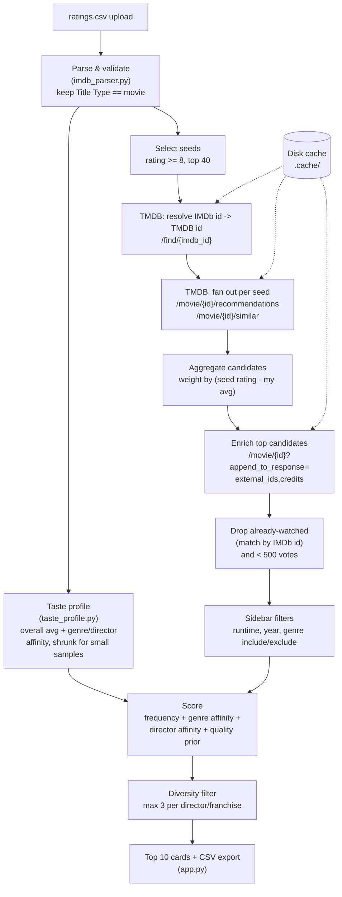

# Next 10 Movies

A local Streamlit app that reads your IMDb ratings export and recommends the next 10 movies you should watch, using TMDB's recommendation/similar endpoints combined with a taste profile built from your own ratings.

## Setup

1. Create a virtual environment and install dependencies:

   ```
   python -m venv .venv
   .venv\Scripts\activate
   pip install -r requirements.txt
   ```

2. Get a free TMDB API key at https://www.themoviedb.org/settings/api, then create a `.env` file (copy `.env.example`):

   ```
   TMDB_API_KEY=your_tmdb_api_key_here
   ```

## Run the app

```
streamlit run app.py
```

Then open the URL Streamlit prints (usually http://localhost:8501), upload your IMDb `ratings.csv` export (from IMDb: **Your Ratings → ⋯ menu → Export**), and click **Find my next 10 movies**.

There's also a "use bundled sample_ratings.csv" checkbox for a quick demo without your own export.

## How it works



1. **Parse** — validates and normalizes the uploaded CSV, keeping only rows where `Title Type` is `movie`.
2. **Taste profile** — computes your overall average rating plus per-genre and per-director affinity scores (shrunk toward the mean for small sample sizes so a single 10/10 doesn't dominate).
3. **Candidate generation** — for your highest-rated movies (rating ≥ 8, capped at your top 40), resolves each to a TMDB ID and pulls `/movie/{id}/recommendations` and `/movie/{id}/similar`, weighting each source movie by how far above your average you rated it.
4. **Filtering** — drops anything already in your ratings CSV (matched by IMDb ID) and anything under 500 TMDB votes.
5. **Scoring** — combines weighted recommendation frequency, genre affinity, director affinity, and a small TMDB quality prior, then applies a diversity rule (max 3 picks per director or franchise).
6. **UI** — sidebar filters (runtime, release year, include/exclude genres) are applied before ranking. Results are shown as cards with poster, title, year, runtime, genres, a "why" explanation, and a link to the IMDb page. You can download the results as CSV.

All TMDB responses are cached on disk under `.cache/` so re-running with the same filters is fast and doesn't re-hit the API.

## Tests

```
pytest
```

Tests cover CSV parsing/validation (`tests/test_imdb_parser.py`), taste-profile affinity scoring (`tests/test_profile.py`), and candidate scoring/filtering/diversity logic (`tests/test_recommender.py`), using `sample_ratings.csv` as fixture data.

