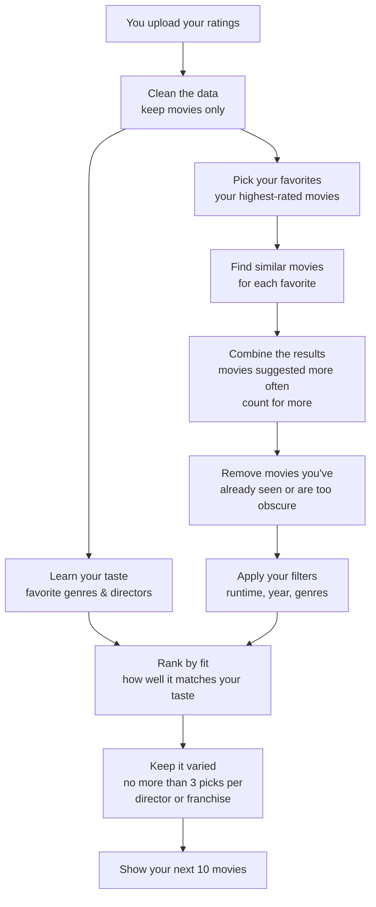

# Next 10 Movies

A local Streamlit app that reads your IMDb ratings export and recommends the next 10 movies you should watch, using TMDB's recommendation/similar endpoints combined with a taste profile built from your own ratings.

## Setup

1. Create a virtual environment and install dependencies:

   ```
   python -m venv .venv
   .venv\Scripts\activate
   pip install -r requirements.txt
   ```

2. Get a free TMDB API key at https://www.themoviedb.org/settings/api, then create a `.env` file (copy `.env.example`):

   ```
   TMDB_API_KEY=your_tmdb_api_key_here
   ```

## Run the app

```
streamlit run app.py
```

Then open the URL Streamlit prints (usually http://localhost:8501), upload your IMDb `ratings.csv` export (from IMDb: **Your Ratings → ⋯ menu → Export**), and click **Find my next 10 movies**.

There's also a "use bundled sample_ratings.csv" checkbox for a quick demo without your own export.

## How it works



1. **Clean the data** — keeps only real movies from your upload, ignoring TV shows and episodes.
2. **Learn your taste** — works out your average rating, plus which genres and directors you rate consistently above or below your own average (a single one-off 10/10 doesn't skew the whole profile).
3. **Find similar movies** — for your highest-rated movies, looks up what other viewers who liked those also enjoyed.
4. **Combine and clean up** — movies suggested by several of your favorites score higher; anything you've already rated, or that's too obscure (very few votes), gets dropped.
5. **Rank by fit** — combines how often a movie was suggested, how well it matches your favorite genres/directors, and its overall quality, then makes sure the final list isn't dominated by one director or franchise.
6. **Show results** — your sidebar filters (runtime, year, genres) are applied before ranking. Results appear as cards with poster, title, year, runtime, genres, a "why" explanation, and a link to IMDb. You can load 10 more, or download the list as CSV.

Movie data is cached on disk so re-running with the same filters is fast and doesn't repeat lookups unnecessarily.

### Optional: natural-language "why" text

The "why" explanation for each recommendation is generated directly from your data by default (e.g. *"Recommended by 4 of your favorites; matches your love of sci-fi and Nolan."*) — no AI involved. If you want it rephrased in more natural prose, there's an opt-in sidebar checkbox that uses an open-weight model (currently `openai/gpt-oss-20b`) hosted free by [Groq](https://console.groq.com) to rewrite it. This requires a free `GROQ_API_KEY` in `.env` and is off by default; the app works fully without it.

## Tests

```
pytest
```

Tests cover CSV parsing/validation (`tests/test_imdb_parser.py`), taste-profile affinity scoring (`tests/test_profile.py`), and candidate scoring/filtering/diversity logic (`tests/test_recommender.py`), using `sample_ratings.csv` as fixture data.

