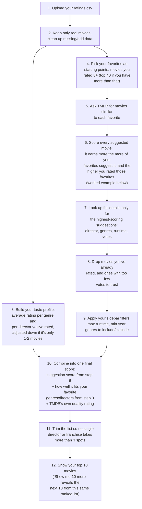

# Next 10 Movies

A local Streamlit app that reads your IMDb ratings export and recommends the next 10 movies you should watch, using TMDB's recommendation/similar endpoints combined with a taste profile built from your own ratings.

## Setup

1. Create a virtual environment and install dependencies:

   ```
   python -m venv .venv
   .venv\Scripts\activate
   pip install -r requirements.txt
   ```

2. Get a free TMDB API key at https://www.themoviedb.org/settings/api, then create a `.env` file (copy `.env.example`):

   ```
   TMDB_API_KEY=your_tmdb_api_key_here
   ```

## Run the app

```
streamlit run app.py
```

Then open the URL Streamlit prints (usually http://localhost:8501), upload your IMDb `ratings.csv` export (from IMDb: **Your Ratings → ⋯ menu → Export**), and click **Find my next 10 movies**.

There's also a "use bundled sample_ratings.csv" checkbox for a quick demo without your own export.

## How it works



1. **Upload** — you upload your IMDb `ratings.csv` export.
2. **Clean the data** — keeps only real movies from your upload, ignoring TV shows and episodes, and handles missing/odd values gracefully.
3. **Build your taste profile** — your average rating, plus a per-genre and per-director average, pulled toward the overall average when you've only rated one or two of them (so a single 10/10 from an unknown director doesn't skew everything).
4. **Pick your favorites** — your highest-rated movies (rating ≥ 8, capped at your top 40) become the starting points for discovery.
5. **Ask TMDB for similar movies** — for each favorite, ask what viewers who liked it also liked/were recommended.
6. **Score each suggested movie by who's recommending it** — explained with an example below.
7. **Enrich the top candidates** — pull real details (director, genres, runtime, vote count) only for the highest-scoring candidates, to keep API usage reasonable.
8. **Drop what doesn't belong** — anything already in your ratings, or with too few TMDB votes to be a trustworthy candidate.
9. **Apply your filters** — your sidebar filters (runtime/year/genre) narrow the candidates down before final scoring.
10. **Final score** — combines the suggestion score (step 6), how well it fits your favorite genres/directors (step 3), and a small quality boost from TMDB's own rating.
11. **Diversify** — the ranked list is walked top-down, skipping anything that would push a single director or franchise past 3 picks, so the final list isn't just five Nolan movies.
12. **Show results** — top 10 appear as cards (poster, why-explanation, IMDb link); "Show me 10 more" reveals the next batch from the same scored list instantly, no extra lookups needed.

Movie data is cached on disk so re-running with the same filters is fast and doesn't repeat lookups unnecessarily.

### A worked example of step 6

Say your average rating is 7, and three of your favorites are:

| Your favorite | Your rating | "Points" it hands out (rating − your average) |
|---|---|---|
| Inception | 10 | 3 |
| The Prestige | 9 | 2 |
| Memento | 8 | 1 |

The higher you rated a movie, the more "points" it's allowed to hand out to whatever TMDB says is similar to it — a favorite you rated 10/10 is a stronger vote of confidence than one you rated 8/10.

Now say TMDB tells us:
- **Interstellar** is similar to both *Inception* and *The Prestige*
- **Dunkirk** is similar to *Inception* only

Interstellar's score = 3 (from Inception) + 2 (from The Prestige) = **5**
Dunkirk's score = 3 (from Inception) = **3**

Interstellar ends up ranked higher — not just because it's "similar to a favorite," but because it was independently pointed to by *two* of your favorites, including your highest-rated one. That's the whole mechanic: every suggestion is a vote, the vote is worth more if it came from a movie you loved more, and votes for the same movie from different favorites stack up.

### Optional: natural-language "why" text

The "why" explanation for each recommendation is generated directly from your data by default (e.g. *"Recommended by 4 of your favorites; matches your love of sci-fi and Nolan."*) — no AI involved. If you want it rephrased in more natural prose, there's an opt-in sidebar checkbox that uses an open-weight model (currently `openai/gpt-oss-20b`) hosted free by [Groq](https://console.groq.com) to rewrite it. This requires a free `GROQ_API_KEY` in `.env` and is off by default; the app works fully without it.

## Tests

```
pytest
```

Tests cover CSV parsing/validation (`tests/test_imdb_parser.py`), taste-profile affinity scoring (`tests/test_profile.py`), and candidate scoring/filtering/diversity logic (`tests/test_recommender.py`), using `sample_ratings.csv` as fixture data.

